# The first five row of the table originally obtained from telbib.eso.org 
+ The affiliations of authors are obtained from NASA ADS
+ The countries of the affiliations are interpreted from the affiliations.
+ The list of the proposal authors are obtained from ALMA Science Archive.
+ The values in the "archive" column are defined by whether any of article authors are included in the proposal authors of the project that is used in the article.
+ The values in the "archivedata" columns are the same as in the "arhive" columns, but collapsed.
+ The "region" column is a country in which the affiliation of the first author is located.
+ See Appendix to see which countries are classified to which region. Note 'EA' includs Japan, Taiwan and Korea.


```python
from astroquery.alma import Alma
from astroquery import nasa_ads as na

import urllib
import xml.etree.ElementTree as ET

import pandas as pd

import numpy as np
import re

import matplotlib.pyplot as plt

df_xml = pd.read_pickle('./df_telbib_alma_aff_archive.pkl')
df_xml.head()
```


<div>
<style scoped>
    .dataframe tbody tr th:only-of-type {
        vertical-align: middle;
    }

    .dataframe tbody tr th {
        vertical-align: top;
    }

    .dataframe thead th {
        text-align: right;
    }
</style>
<table border="1" class="dataframe">
  <thead>
    <tr style="text-align: right;">
      <th></th>
      <th>authors</th>
      <th>year</th>
      <th>programids</th>
      <th>bibcode</th>
      <th>journal</th>
      <th>almaprojcode</th>
      <th>affiliations</th>
      <th>countries</th>
      <th>archive</th>
      <th>archivedata</th>
      <th>region</th>
    </tr>
  </thead>
  <tbody>
    <tr>
      <th>0</th>
      <td>:Oteo, I.:Zwaan, M. A.:Ivison, R. J.:Smail, I....</td>
      <td>2016</td>
      <td>:2012.1.00076.S                : North America...</td>
      <td>2016ApJ...822...36O</td>
      <td>ApJ</td>
      <td>[2013.1.00879.S                , 2012.1.00988....</td>
      <td>[Institute for Astronomy, University of Edinbu...</td>
      <td>[UK, Germany, UK, UK, Germany]</td>
      <td>[archive, archive, PI, archive, archive, archi...</td>
      <td>PI+archive</td>
      <td>EU</td>
    </tr>
    <tr>
      <th>1</th>
      <td>:Fujimoto, Seiji:Ouchi, Masami:Shibuya, Takato...</td>
      <td>2017</td>
      <td>:2011.0.00097.S                : North America...</td>
      <td>2017ApJ...850...83F</td>
      <td>ApJ</td>
      <td>[2011.0.00097.S                , 2012.1.00775....</td>
      <td>[Institute for Cosmic Ray Research, The Univer...</td>
      <td>[Japan, Japan, Japan, Japan]</td>
      <td>[archive, archive, archive, archive, archive, ...</td>
      <td>PI+archive</td>
      <td>EA</td>
    </tr>
    <tr>
      <th>2</th>
      <td>:Klitsch, A.:Zwaan, M. A.:Péroux, C.:Smail, I....</td>
      <td>2019</td>
      <td>:2012.1.00090.S                : Europe:2012.1...</td>
      <td>2019MNRAS.482L..65K</td>
      <td>MNRAS</td>
      <td>[2015.1.00330.S                , 2015.1.01290....</td>
      <td>[European Southern Observatory, Karl-Schwarzsc...</td>
      <td>[Germany, Germany, France, UK, Germany, German...</td>
      <td>[archive, archive, PI, archive, PI, archive, a...</td>
      <td>PI+archive</td>
      <td>EU</td>
    </tr>
    <tr>
      <th>3</th>
      <td>:Ando, Ryo:Kohno, Kotaro:Tamura, Yoichi:Izumi,...</td>
      <td>2016</td>
      <td>:2011.0.00017.S                : Europe:2011.0...</td>
      <td>2016PASJ...68....6A</td>
      <td>PASJ</td>
      <td>[2011.0.00273.S                , 2011.0.00733....</td>
      <td>[Institute of Astronomy, The University of Tok...</td>
      <td>[Japan, Japan, Japan, Japan, Japan, Japan]</td>
      <td>[PI, archive, archive, archive, archive, archi...</td>
      <td>PI+archive</td>
      <td>EA</td>
    </tr>
    <tr>
      <th>4</th>
      <td>:van der Marel, Nienke:Dong, Ruobing:di France...</td>
      <td>2019</td>
      <td>:2011.0.00015.SV               : East Asia:201...</td>
      <td>2019ApJ...872..112V</td>
      <td>ApJ</td>
      <td>[2015.1.00486.S                , 2013.1.00601....</td>
      <td>[Herzberg Astronomy and Astrophysics Programs,...</td>
      <td>[Canada, Canada, Canada, USA, USA]</td>
      <td>[archive, archive, archive, archive, archive, ...</td>
      <td>PI+archive</td>
      <td>NA</td>
    </tr>
  </tbody>
</table>
</div>


## Fig.1 
### The number of publications per region between 2012 and 2018


```python
from pandas.plotting import table

fig, ax = plt.subplots(1, 1)

table(ax,df_xml["region"].value_counts(),
      loc='upper right', colWidths=[0.2, 0.2, 0.2])

df_xml["region"].value_counts().plot(kind="bar",
                                     title='The number of publications per region',
                                     ax=ax)
```


    <matplotlib.axes._subplots.AxesSubplot at 0x125befb70>


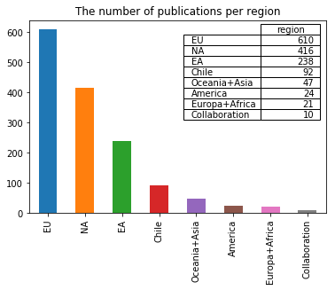


## Fig.2
### The fraction of publications per region between 2012 and 2018


```python
df_xml['region'].value_counts().plot.pie(autopct='%i',title='The fraction of publications per region')
```


    <matplotlib.axes._subplots.AxesSubplot at 0x11cfa4f28>


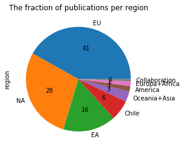


## Table 2
### The number of publications making use of PI and archival data


```python
#for df1['e'] = Series(np.random.randn(sLength), index=df1.index)

df_archive = pd.DataFrame({'All':df_xml['archivedata'].value_counts(),
    'EA':df_xml[df_xml["region"]=='EA']['archivedata'].value_counts(), 
    'NA':df_xml[df_xml["region"]=='NA']['archivedata'].value_counts(),
    'EU':df_xml[df_xml["region"]=='EU']['archivedata'].value_counts(),
    'Chile':df_xml[df_xml["region"]=='Chile']['archivedata'].value_counts()})

df_archive
#.plot(kind="pie")
```


<div>
<style scoped>
    .dataframe tbody tr th:only-of-type {
        vertical-align: middle;
    }

    .dataframe tbody tr th {
        vertical-align: top;
    }

    .dataframe thead th {
        text-align: right;
    }
</style>
<table border="1" class="dataframe">
  <thead>
    <tr style="text-align: right;">
      <th></th>
      <th>All</th>
      <th>EA</th>
      <th>NA</th>
      <th>EU</th>
      <th>Chile</th>
    </tr>
  </thead>
  <tbody>
    <tr>
      <th>PI</th>
      <td>1083</td>
      <td>171</td>
      <td>307</td>
      <td>473</td>
      <td>73</td>
    </tr>
    <tr>
      <th>archive</th>
      <td>255</td>
      <td>36</td>
      <td>68</td>
      <td>102</td>
      <td>12</td>
    </tr>
    <tr>
      <th>PI+archive</th>
      <td>120</td>
      <td>31</td>
      <td>41</td>
      <td>35</td>
      <td>7</td>
    </tr>
  </tbody>
</table>
</div>


## Fig.3
### The fraction of publications making use of PI and/or archival data 


```python
df_archive.plot(kind='pie',subplots=True,figsize=(20,10),autopct='%i')
```


    array([<matplotlib.axes._subplots.AxesSubplot object at 0x11cddeda0>,
           <matplotlib.axes._subplots.AxesSubplot object at 0x11d5412b0>,
           <matplotlib.axes._subplots.AxesSubplot object at 0x11d5693c8>,
           <matplotlib.axes._subplots.AxesSubplot object at 0x11d5944e0>,
           <matplotlib.axes._subplots.AxesSubplot object at 0x11d5bc5f8>],
          dtype=object)


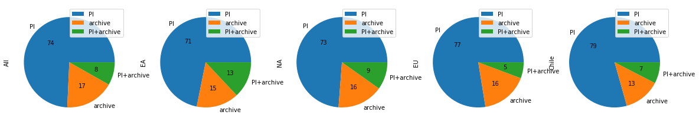


## Fig.4
### The fraction of publications making use of PI and/or archival data per region.


```python
df_archive_transposed = (df_archive/df_archive.sum()).T
#df_archive_transposed
df_archive_transposed.plot.bar(stacked=True,rot=45,title='Fraction of publications making use of archival data ')
```


    <matplotlib.axes._subplots.AxesSubplot at 0x11cde1470>


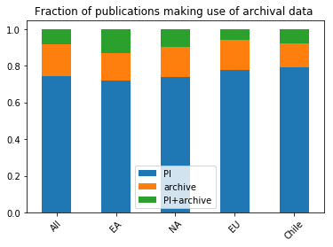


## Fig.5
### Evolution of fraction of publications making use of PI and/or archival data per region.


```python
def evolutionpub(df,addtitle):
    tmp_dict = {}
    for year in range(2012,2020):
        tmp_dict.update({year:df[df["year"]==str(year)]['archivedata'].value_counts()})
    df_archive = pd.DataFrame(tmp_dict)
    #df_archive.plot(kind='pie',subplots=True,figsize=(30,6),autopct='%i')

    df_archive_transposed = (df_archive/df_archive.sum()).T
    #df_archive_transposed
    df_archive_transposed.plot.bar(stacked=True,rot=45,title='Evolution of fraction of publications {:}'.format(addtitle))

    df_archive_transposed = df_archive.T
    df_archive_transposed.plot.bar(stacked=True,rot=45,title='Evolution of number of publications {:}'.format(addtitle))
    
    print('Table the number of publications', addtitle)
    display(df_archive_transposed)
```


```python
evolutionpub(df_xml,'All')

df_xml_trim = df_xml[df_xml["region"]=='EA']
evolutionpub(df_xml_trim,'EA')

df_xml_trim = df_xml[df_xml["region"]=='EU']
evolutionpub(df_xml_trim,'EU')

df_xml_trim = df_xml[df_xml["region"]=='NA']
evolutionpub(df_xml_trim,'NA')
```

    Table the number of publications All


<div>
<style scoped>
    .dataframe tbody tr th:only-of-type {
        vertical-align: middle;
    }

    .dataframe tbody tr th {
        vertical-align: top;
    }

    .dataframe thead th {
        text-align: right;
    }
</style>
<table border="1" class="dataframe">
  <thead>
    <tr style="text-align: right;">
      <th></th>
      <th>PI</th>
      <th>PI+archive</th>
      <th>archive</th>
    </tr>
  </thead>
  <tbody>
    <tr>
      <th>2012</th>
      <td>6.0</td>
      <td>1.0</td>
      <td>12.0</td>
    </tr>
    <tr>
      <th>2013</th>
      <td>45.0</td>
      <td>NaN</td>
      <td>20.0</td>
    </tr>
    <tr>
      <th>2014</th>
      <td>77.0</td>
      <td>4.0</td>
      <td>16.0</td>
    </tr>
    <tr>
      <th>2015</th>
      <td>96.0</td>
      <td>9.0</td>
      <td>42.0</td>
    </tr>
    <tr>
      <th>2016</th>
      <td>164.0</td>
      <td>14.0</td>
      <td>58.0</td>
    </tr>
    <tr>
      <th>2017</th>
      <td>269.0</td>
      <td>22.0</td>
      <td>47.0</td>
    </tr>
    <tr>
      <th>2018</th>
      <td>295.0</td>
      <td>46.0</td>
      <td>38.0</td>
    </tr>
    <tr>
      <th>2019</th>
      <td>131.0</td>
      <td>24.0</td>
      <td>22.0</td>
    </tr>
  </tbody>
</table>
</div>


    Table the number of publications EA


<div>
<style scoped>
    .dataframe tbody tr th:only-of-type {
        vertical-align: middle;
    }

    .dataframe tbody tr th {
        vertical-align: top;
    }

    .dataframe thead th {
        text-align: right;
    }
</style>
<table border="1" class="dataframe">
  <thead>
    <tr style="text-align: right;">
      <th></th>
      <th>PI</th>
      <th>PI+archive</th>
      <th>archive</th>
    </tr>
  </thead>
  <tbody>
    <tr>
      <th>2012</th>
      <td>2.0</td>
      <td>1.0</td>
      <td>1.0</td>
    </tr>
    <tr>
      <th>2013</th>
      <td>7.0</td>
      <td>NaN</td>
      <td>NaN</td>
    </tr>
    <tr>
      <th>2014</th>
      <td>12.0</td>
      <td>3.0</td>
      <td>1.0</td>
    </tr>
    <tr>
      <th>2015</th>
      <td>14.0</td>
      <td>2.0</td>
      <td>7.0</td>
    </tr>
    <tr>
      <th>2016</th>
      <td>24.0</td>
      <td>8.0</td>
      <td>11.0</td>
    </tr>
    <tr>
      <th>2017</th>
      <td>42.0</td>
      <td>5.0</td>
      <td>11.0</td>
    </tr>
    <tr>
      <th>2018</th>
      <td>50.0</td>
      <td>7.0</td>
      <td>4.0</td>
    </tr>
    <tr>
      <th>2019</th>
      <td>20.0</td>
      <td>5.0</td>
      <td>1.0</td>
    </tr>
  </tbody>
</table>
</div>


    Table the number of publications EU


<div>
<style scoped>
    .dataframe tbody tr th:only-of-type {
        vertical-align: middle;
    }

    .dataframe tbody tr th {
        vertical-align: top;
    }

    .dataframe thead th {
        text-align: right;
    }
</style>
<table border="1" class="dataframe">
  <thead>
    <tr style="text-align: right;">
      <th></th>
      <th>PI</th>
      <th>PI+archive</th>
      <th>archive</th>
    </tr>
  </thead>
  <tbody>
    <tr>
      <th>2012</th>
      <td>2.0</td>
      <td>NaN</td>
      <td>6.0</td>
    </tr>
    <tr>
      <th>2013</th>
      <td>17.0</td>
      <td>NaN</td>
      <td>7.0</td>
    </tr>
    <tr>
      <th>2014</th>
      <td>28.0</td>
      <td>1.0</td>
      <td>8.0</td>
    </tr>
    <tr>
      <th>2015</th>
      <td>40.0</td>
      <td>3.0</td>
      <td>15.0</td>
    </tr>
    <tr>
      <th>2016</th>
      <td>77.0</td>
      <td>2.0</td>
      <td>24.0</td>
    </tr>
    <tr>
      <th>2017</th>
      <td>125.0</td>
      <td>6.0</td>
      <td>18.0</td>
    </tr>
    <tr>
      <th>2018</th>
      <td>129.0</td>
      <td>11.0</td>
      <td>15.0</td>
    </tr>
    <tr>
      <th>2019</th>
      <td>55.0</td>
      <td>12.0</td>
      <td>9.0</td>
    </tr>
  </tbody>
</table>
</div>


    Table the number of publications NA


<div>
<style scoped>
    .dataframe tbody tr th:only-of-type {
        vertical-align: middle;
    }

    .dataframe tbody tr th {
        vertical-align: top;
    }

    .dataframe thead th {
        text-align: right;
    }
</style>
<table border="1" class="dataframe">
  <thead>
    <tr style="text-align: right;">
      <th></th>
      <th>PI</th>
      <th>PI+archive</th>
      <th>archive</th>
    </tr>
  </thead>
  <tbody>
    <tr>
      <th>2012</th>
      <td>2.0</td>
      <td>NaN</td>
      <td>3.0</td>
    </tr>
    <tr>
      <th>2013</th>
      <td>17.0</td>
      <td>NaN</td>
      <td>10.0</td>
    </tr>
    <tr>
      <th>2014</th>
      <td>29.0</td>
      <td>NaN</td>
      <td>4.0</td>
    </tr>
    <tr>
      <th>2015</th>
      <td>29.0</td>
      <td>3.0</td>
      <td>12.0</td>
    </tr>
    <tr>
      <th>2016</th>
      <td>47.0</td>
      <td>3.0</td>
      <td>10.0</td>
    </tr>
    <tr>
      <th>2017</th>
      <td>71.0</td>
      <td>8.0</td>
      <td>11.0</td>
    </tr>
    <tr>
      <th>2018</th>
      <td>81.0</td>
      <td>23.0</td>
      <td>12.0</td>
    </tr>
    <tr>
      <th>2019</th>
      <td>31.0</td>
      <td>4.0</td>
      <td>6.0</td>
    </tr>
  </tbody>
</table>
</div>


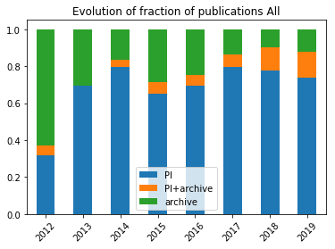


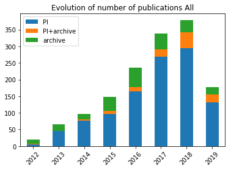


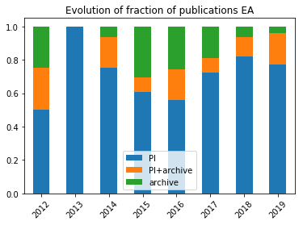


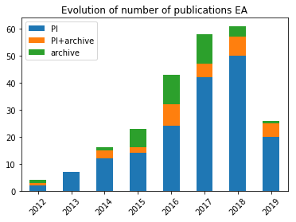


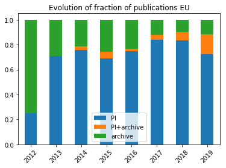


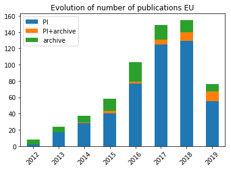


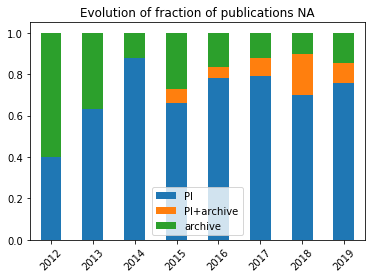


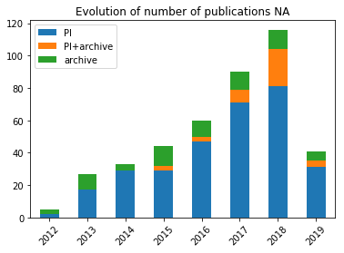


# Appendix
## A List of countries by regional classification


```python
appendix_df = pd.read_pickle('./df_region.pkl')
print('EA\n',appendix_df.index[appendix_df[0]=='EA'])
print('EU (=ESO)\n',appendix_df.index[appendix_df[0]=='EU'])
print('NA\n',appendix_df.index[appendix_df[0]=='NA'])
```

    EA
     Index(['Taiwan', 'Korea', 'Japan'], dtype='object')
    EU (=ESO)
     Index(['Belgium', 'Poland', 'Austria', 'Germany', 'UK', 'Denmark', 'Spain',
           'Netherlands', 'France', 'Portugal', 'Czech Republic', 'Sweden',
           'Switzerland', 'Ireland', 'Italy'],
          dtype='object')
    NA
     Index(['Canada', 'USA'], dtype='object')


## The fraction of publications per Asian country


```python
df_asia = df_xml[df_xml['region']=='Oceania+Asia']
tmp = []
for i in df_asia.index:
    #print(i,end='')
    tmp.append(df_asia[df_asia.index==i]['countries'].values[0][0])
df_asia['first_country'] = tmp
df_asia['first_country'].value_counts().plot.pie(autopct='%i',
    title='The fraction of publications per Asian country ({:})'.format(len(df_asia)))

```

    /Users/rmiura/miniconda3/lib/python3.7/site-packages/ipykernel_launcher.py:6: SettingWithCopyWarning: 
    A value is trying to be set on a copy of a slice from a DataFrame.
    Try using .loc[row_indexer,col_indexer] = value instead
    
    See the caveats in the documentation: http://pandas.pydata.org/pandas-docs/stable/indexing.html#indexing-view-versus-copy
      


    <matplotlib.axes._subplots.AxesSubplot at 0x12702f3c8>


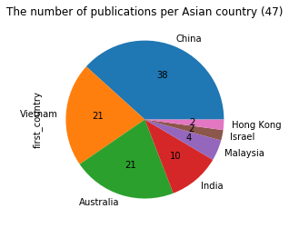


## The fraction of publications making use of PI/archive data for Asian countries


```python
df_asia['archivedata'].value_counts().plot.pie(autopct='%i',
    title='The number of publications of Asian countries except EA ({:})'.format(len(df_ea)))
```


    <matplotlib.axes._subplots.AxesSubplot at 0x12775d208>


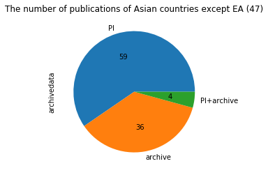

