+++
title = "2019 07 18 ALMA Publication Statistics"
date = 2019-07-18T13:45:23+09:00
draft = false

# Authors. Comma separated list, e.g. `["Bob Smith", "David Jones"]`.
authors = []

# Tags and categories
# For example, use `tags = []` for no tags, or the form `tags = ["A Tag", "Another Tag"]` for one or more tags.
tags = []
categories = []

# Projects (optional).
#   Associate this post with one or more of your projects.
#   Simply enter your project's folder or file name without extension.
#   E.g. `projects = ["deep-learning"]` references 
#   `content/project/deep-learning/index.md`.
#   Otherwise, set `projects = []`.
# projects = ["internal-project"]

# Featured image
# To use, add an image named `featured.jpg/png` to your page's folder. 
[image]
  # Caption (optional)
  caption = ""

  # Focal point (optional)
  # Options: Smart, Center, TopLeft, Top, TopRight, Left, Right, BottomLeft, Bottom, BottomRight
  focal_point = ""
+++


# NOTE
- The first five row of the table originally obtained from telbib.eso.org
- The affiliations of authors are obtained from NASA ADS
- The countries of the affiliations are interpreted from the affiliations.
- The list of the proposal authors are obtained from ALMA Science Archive.
- The values in the “archive” column are defined by whether any of article authors are included in the proposal authors of the project that is used in the article.
- The values in the “archivedata” columns are the same as in the “arhive” columns, but collapsed.
- The “region” column is a country in which the affiliation of the first author is located.
- See Appendix to see which countries are classified to which region. Note ‘EA’ includs Japan, Taiwan and Korea.


```python
from astroquery.alma import Alma
from astroquery import nasa_ads as na

import urllib
import xml.etree.ElementTree as ET

import pandas as pd

import numpy as np
import re

import matplotlib.pyplot as plt

#df_xml = pd.read_pickle('./df_telbib_alma_aff_archive.pkl')
df_xml = pd.read_pickle('./2019-07-17_telbib_alma_aff_countires_archive.pkl')
df_xml.head()

import seaborn as sns
sns.set(font_scale=1.4,color_codes=True)
#sns.set_style('whitegrid',{'axes.grid' : False})
#sns.set_style('darkgrid')
sns.set_style('dark',{'ytick.left': True})
#sns.despine()
#sns.set_style('ticks')
sns.axes_style()
#sns.set()  ## set back to default
#sns.set_context('paper')  ## thinner lines
sns.set_context('talk')   ## thicker, larger
#sns.set_context('poster') ## thicker, larger
#sns.set_context('notebook')
```

## Fig.1 
### The number of publications per region between 2012 and 2019


```python
from pandas.plotting import table

fig, ax = plt.subplots(1, 1)

df_xml["region"].value_counts().plot(kind="bar",rot=45,
                                     title='The number of publications per region',
                                     ax=ax)

table(ax,df_xml["region"].value_counts(),
      loc='upper right', colWidths=[0.1, 0.1, 0.1])

```


    <matplotlib.table.Table at 0x1a2b028240>


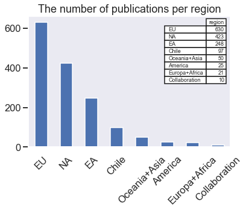


## Fig.2
### The fraction of publications per region between 2012 and 2019


```python
df_xml['region'].value_counts().plot.pie(autopct='%i',title='The fraction of publications per region')
```


    <matplotlib.axes._subplots.AxesSubplot at 0x1a2afed7b8>


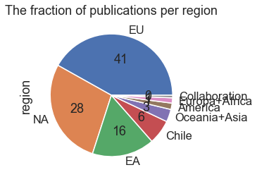


## Table 2
### The number of publications making use of PI and archival data


```python
#for df1['e'] = Series(np.random.randn(sLength), index=df1.index)

df_archive = pd.DataFrame({'All':df_xml['archivedata'].value_counts(),
    'EA':df_xml[df_xml["region"]=='EA']['archivedata'].value_counts(), 
    'NA':df_xml[df_xml["region"]=='NA']['archivedata'].value_counts(),
    'EU':df_xml[df_xml["region"]=='EU']['archivedata'].value_counts(),
    'Chile':df_xml[df_xml["region"]=='Chile']['archivedata'].value_counts()})

df_archive
#.plot(kind="pie")
```


<div>
<style scoped>
    .dataframe tbody tr th:only-of-type {
        vertical-align: middle;
    }

    .dataframe tbody tr th {
        vertical-align: top;
    }

    .dataframe thead th {
        text-align: right;
    }
</style>
<table border="1" class="dataframe">
  <thead>
    <tr style="text-align: right;">
      <th></th>
      <th>All</th>
      <th>EA</th>
      <th>NA</th>
      <th>EU</th>
      <th>Chile</th>
    </tr>
  </thead>
  <tbody>
    <tr>
      <th>PI</th>
      <td>1116</td>
      <td>178</td>
      <td>311</td>
      <td>487</td>
      <td>78</td>
    </tr>
    <tr>
      <th>archive</th>
      <td>261</td>
      <td>38</td>
      <td>70</td>
      <td>104</td>
      <td>12</td>
    </tr>
    <tr>
      <th>PI+archive</th>
      <td>127</td>
      <td>32</td>
      <td>42</td>
      <td>39</td>
      <td>7</td>
    </tr>
  </tbody>
</table>
</div>


## Fig.3
### The fraction of publications making use of PI and/or archival data 


```python
df_archive.plot(kind='pie',subplots=True,figsize=(30,10),autopct='%i')
```


    array([<matplotlib.axes._subplots.AxesSubplot object at 0x1a292950f0>,
           <matplotlib.axes._subplots.AxesSubplot object at 0x1a26e6c898>,
           <matplotlib.axes._subplots.AxesSubplot object at 0x1a29c876a0>,
           <matplotlib.axes._subplots.AxesSubplot object at 0x1a29c8d320>,
           <matplotlib.axes._subplots.AxesSubplot object at 0x1a299cbe48>],
          dtype=object)


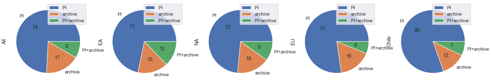


## Fig.4
### The fraction of publications making use of PI and/or archival data per region.


```python
df_archive_transposed = (df_archive/df_archive.sum()).T
#df_archive_transposed
df_archive_transposed.plot.bar(stacked=True,rot=45,title='Fraction of publications making use of archival data ')
```


    <matplotlib.axes._subplots.AxesSubplot at 0x1a2afdabe0>


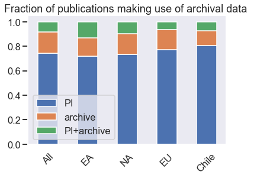


## Fig.5
### Evolution of number and fraction of publications making use of PI and/or archival data per region.


```python
def evolutionpub(df,addtitle):
    tmp_dict = {}
    for year in range(2012,2020):
        tmp_dict.update({year:df[df["year"]==str(year)]['archivedata'].value_counts()})
    df_archive = pd.DataFrame(tmp_dict)
    #df_archive.plot(kind='pie',subplots=True,figsize=(30,6),autopct='%i')

    df_archive_transposed = (df_archive/df_archive.sum()).T
    #df_archive_transposed
    df_archive_transposed.plot.bar(stacked=True,rot=45,title='Evolution of fraction of publications {:}'.format(addtitle))

    df_archive_transposed = df_archive.T
    df_archive_transposed.plot.bar(stacked=True,rot=45,title='Evolution of number of publications {:}'.format(addtitle))
    
    print('Table the number of publications', addtitle)
    display(df_archive_transposed)
```


```python
evolutionpub(df_xml,'All')

df_xml_trim = df_xml[df_xml["region"]=='EA']
evolutionpub(df_xml_trim,'EA')

df_xml_trim = df_xml[df_xml["region"]=='EU']
evolutionpub(df_xml_trim,'EU')

df_xml_trim = df_xml[df_xml["region"]=='NA']
evolutionpub(df_xml_trim,'NA')
```

    Table the number of publications All


<div>
<style scoped>
    .dataframe tbody tr th:only-of-type {
        vertical-align: middle;
    }

    .dataframe tbody tr th {
        vertical-align: top;
    }

    .dataframe thead th {
        text-align: right;
    }
</style>
<table border="1" class="dataframe">
  <thead>
    <tr style="text-align: right;">
      <th></th>
      <th>PI</th>
      <th>PI+archive</th>
      <th>archive</th>
    </tr>
  </thead>
  <tbody>
    <tr>
      <th>2012</th>
      <td>6.0</td>
      <td>1.0</td>
      <td>12.0</td>
    </tr>
    <tr>
      <th>2013</th>
      <td>45.0</td>
      <td>NaN</td>
      <td>20.0</td>
    </tr>
    <tr>
      <th>2014</th>
      <td>77.0</td>
      <td>4.0</td>
      <td>16.0</td>
    </tr>
    <tr>
      <th>2015</th>
      <td>96.0</td>
      <td>9.0</td>
      <td>42.0</td>
    </tr>
    <tr>
      <th>2016</th>
      <td>164.0</td>
      <td>14.0</td>
      <td>58.0</td>
    </tr>
    <tr>
      <th>2017</th>
      <td>269.0</td>
      <td>22.0</td>
      <td>47.0</td>
    </tr>
    <tr>
      <th>2018</th>
      <td>295.0</td>
      <td>46.0</td>
      <td>38.0</td>
    </tr>
    <tr>
      <th>2019</th>
      <td>164.0</td>
      <td>31.0</td>
      <td>28.0</td>
    </tr>
  </tbody>
</table>
</div>


    Table the number of publications EA


<div>
<style scoped>
    .dataframe tbody tr th:only-of-type {
        vertical-align: middle;
    }

    .dataframe tbody tr th {
        vertical-align: top;
    }

    .dataframe thead th {
        text-align: right;
    }
</style>
<table border="1" class="dataframe">
  <thead>
    <tr style="text-align: right;">
      <th></th>
      <th>PI</th>
      <th>PI+archive</th>
      <th>archive</th>
    </tr>
  </thead>
  <tbody>
    <tr>
      <th>2012</th>
      <td>2.0</td>
      <td>1.0</td>
      <td>1.0</td>
    </tr>
    <tr>
      <th>2013</th>
      <td>7.0</td>
      <td>NaN</td>
      <td>NaN</td>
    </tr>
    <tr>
      <th>2014</th>
      <td>12.0</td>
      <td>3.0</td>
      <td>1.0</td>
    </tr>
    <tr>
      <th>2015</th>
      <td>14.0</td>
      <td>2.0</td>
      <td>7.0</td>
    </tr>
    <tr>
      <th>2016</th>
      <td>24.0</td>
      <td>8.0</td>
      <td>11.0</td>
    </tr>
    <tr>
      <th>2017</th>
      <td>42.0</td>
      <td>5.0</td>
      <td>11.0</td>
    </tr>
    <tr>
      <th>2018</th>
      <td>50.0</td>
      <td>7.0</td>
      <td>4.0</td>
    </tr>
    <tr>
      <th>2019</th>
      <td>27.0</td>
      <td>6.0</td>
      <td>3.0</td>
    </tr>
  </tbody>
</table>
</div>


    Table the number of publications EU


<div>
<style scoped>
    .dataframe tbody tr th:only-of-type {
        vertical-align: middle;
    }

    .dataframe tbody tr th {
        vertical-align: top;
    }

    .dataframe thead th {
        text-align: right;
    }
</style>
<table border="1" class="dataframe">
  <thead>
    <tr style="text-align: right;">
      <th></th>
      <th>PI</th>
      <th>PI+archive</th>
      <th>archive</th>
    </tr>
  </thead>
  <tbody>
    <tr>
      <th>2012</th>
      <td>2.0</td>
      <td>NaN</td>
      <td>6.0</td>
    </tr>
    <tr>
      <th>2013</th>
      <td>17.0</td>
      <td>NaN</td>
      <td>7.0</td>
    </tr>
    <tr>
      <th>2014</th>
      <td>28.0</td>
      <td>1.0</td>
      <td>8.0</td>
    </tr>
    <tr>
      <th>2015</th>
      <td>40.0</td>
      <td>3.0</td>
      <td>15.0</td>
    </tr>
    <tr>
      <th>2016</th>
      <td>77.0</td>
      <td>2.0</td>
      <td>24.0</td>
    </tr>
    <tr>
      <th>2017</th>
      <td>125.0</td>
      <td>6.0</td>
      <td>18.0</td>
    </tr>
    <tr>
      <th>2018</th>
      <td>129.0</td>
      <td>11.0</td>
      <td>15.0</td>
    </tr>
    <tr>
      <th>2019</th>
      <td>69.0</td>
      <td>16.0</td>
      <td>11.0</td>
    </tr>
  </tbody>
</table>
</div>


    Table the number of publications NA


<div>
<style scoped>
    .dataframe tbody tr th:only-of-type {
        vertical-align: middle;
    }

    .dataframe tbody tr th {
        vertical-align: top;
    }

    .dataframe thead th {
        text-align: right;
    }
</style>
<table border="1" class="dataframe">
  <thead>
    <tr style="text-align: right;">
      <th></th>
      <th>PI</th>
      <th>PI+archive</th>
      <th>archive</th>
    </tr>
  </thead>
  <tbody>
    <tr>
      <th>2012</th>
      <td>2.0</td>
      <td>NaN</td>
      <td>3.0</td>
    </tr>
    <tr>
      <th>2013</th>
      <td>17.0</td>
      <td>NaN</td>
      <td>10.0</td>
    </tr>
    <tr>
      <th>2014</th>
      <td>29.0</td>
      <td>NaN</td>
      <td>4.0</td>
    </tr>
    <tr>
      <th>2015</th>
      <td>29.0</td>
      <td>3.0</td>
      <td>12.0</td>
    </tr>
    <tr>
      <th>2016</th>
      <td>47.0</td>
      <td>3.0</td>
      <td>10.0</td>
    </tr>
    <tr>
      <th>2017</th>
      <td>71.0</td>
      <td>8.0</td>
      <td>11.0</td>
    </tr>
    <tr>
      <th>2018</th>
      <td>81.0</td>
      <td>23.0</td>
      <td>12.0</td>
    </tr>
    <tr>
      <th>2019</th>
      <td>35.0</td>
      <td>5.0</td>
      <td>8.0</td>
    </tr>
  </tbody>
</table>
</div>


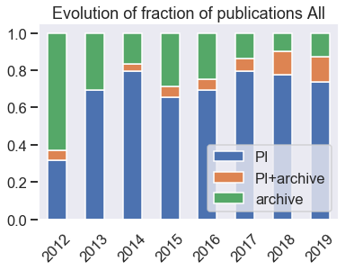


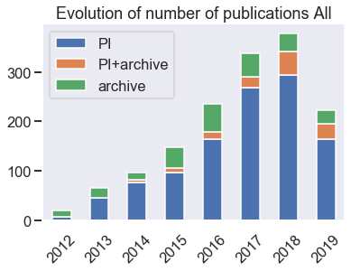


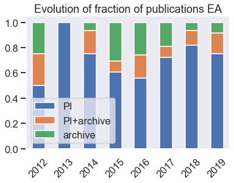


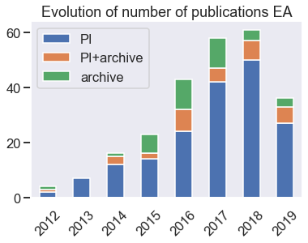


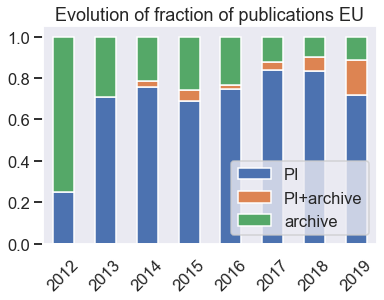


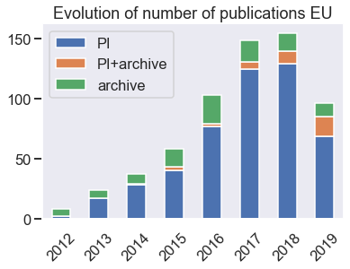


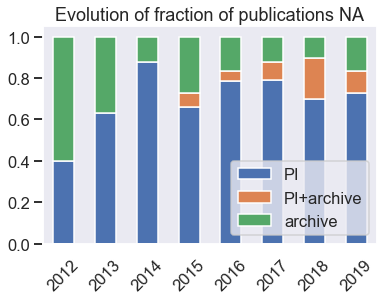


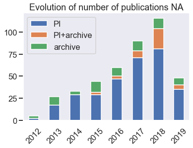


## Fig.6
### Evolution of number & fraction of publications making use of PI and/or archival data per Asian countries


```python
df_region = pd.read_pickle('./df_region.pkl')

regionname = ['EA']

df_ea = df_xml[(df_xml["region"]==regionname[0])]
df_ea['first_country'] = [df_ea.loc[i,'countries'][0] for i in df_ea.index]

fig, ax = plt.subplots(1, 1)

table(ax,df_ea["first_country"].value_counts(),
      loc='upper right', colWidths=[0.3, 0.3, 0.3])

df_ea["first_country"].value_counts().plot(kind="bar",
                                     title='The number of publications per asian countries',
                                     ax=ax)

plt.show()

for country in df_region.index[df_region[0]==regionname[0]]:
    df_ea_trim = df_ea[df_ea['first_country']==country]
    evolutionpub(df_ea_trim,country)
    plt.show()
```

    /Users/rmiura/anaconda3/lib/python3.6/site-packages/ipykernel_launcher.py:6: SettingWithCopyWarning: 
    A value is trying to be set on a copy of a slice from a DataFrame.
    Try using .loc[row_indexer,col_indexer] = value instead
    
    See the caveats in the documentation: http://pandas.pydata.org/pandas-docs/stable/indexing.html#indexing-view-versus-copy
      


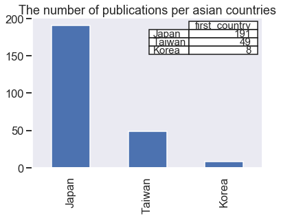


    Table the number of publications Taiwan


<div>
<style scoped>
    .dataframe tbody tr th:only-of-type {
        vertical-align: middle;
    }

    .dataframe tbody tr th {
        vertical-align: top;
    }

    .dataframe thead th {
        text-align: right;
    }
</style>
<table border="1" class="dataframe">
  <thead>
    <tr style="text-align: right;">
      <th></th>
      <th>PI</th>
      <th>PI+archive</th>
      <th>archive</th>
    </tr>
  </thead>
  <tbody>
    <tr>
      <th>2012</th>
      <td>1.0</td>
      <td>NaN</td>
      <td>NaN</td>
    </tr>
    <tr>
      <th>2013</th>
      <td>NaN</td>
      <td>NaN</td>
      <td>NaN</td>
    </tr>
    <tr>
      <th>2014</th>
      <td>2.0</td>
      <td>1.0</td>
      <td>1.0</td>
    </tr>
    <tr>
      <th>2015</th>
      <td>2.0</td>
      <td>NaN</td>
      <td>2.0</td>
    </tr>
    <tr>
      <th>2016</th>
      <td>3.0</td>
      <td>NaN</td>
      <td>2.0</td>
    </tr>
    <tr>
      <th>2017</th>
      <td>10.0</td>
      <td>NaN</td>
      <td>5.0</td>
    </tr>
    <tr>
      <th>2018</th>
      <td>9.0</td>
      <td>1.0</td>
      <td>2.0</td>
    </tr>
    <tr>
      <th>2019</th>
      <td>6.0</td>
      <td>1.0</td>
      <td>1.0</td>
    </tr>
  </tbody>
</table>
</div>


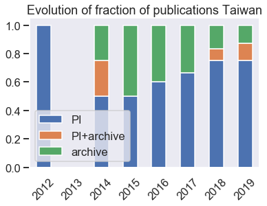


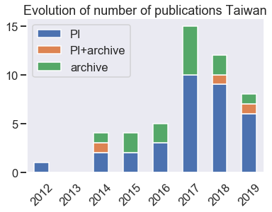


    Table the number of publications Korea


<div>
<style scoped>
    .dataframe tbody tr th:only-of-type {
        vertical-align: middle;
    }

    .dataframe tbody tr th {
        vertical-align: top;
    }

    .dataframe thead th {
        text-align: right;
    }
</style>
<table border="1" class="dataframe">
  <thead>
    <tr style="text-align: right;">
      <th></th>
      <th>PI</th>
    </tr>
  </thead>
  <tbody>
    <tr>
      <th>2012</th>
      <td>NaN</td>
    </tr>
    <tr>
      <th>2013</th>
      <td>NaN</td>
    </tr>
    <tr>
      <th>2014</th>
      <td>NaN</td>
    </tr>
    <tr>
      <th>2015</th>
      <td>NaN</td>
    </tr>
    <tr>
      <th>2016</th>
      <td>2.0</td>
    </tr>
    <tr>
      <th>2017</th>
      <td>2.0</td>
    </tr>
    <tr>
      <th>2018</th>
      <td>3.0</td>
    </tr>
    <tr>
      <th>2019</th>
      <td>1.0</td>
    </tr>
  </tbody>
</table>
</div>


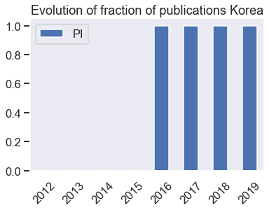


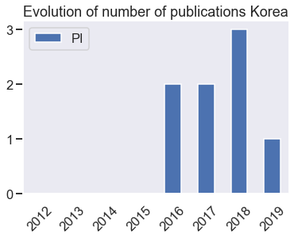


    Table the number of publications Japan


<div>
<style scoped>
    .dataframe tbody tr th:only-of-type {
        vertical-align: middle;
    }

    .dataframe tbody tr th {
        vertical-align: top;
    }

    .dataframe thead th {
        text-align: right;
    }
</style>
<table border="1" class="dataframe">
  <thead>
    <tr style="text-align: right;">
      <th></th>
      <th>PI</th>
      <th>PI+archive</th>
      <th>archive</th>
    </tr>
  </thead>
  <tbody>
    <tr>
      <th>2012</th>
      <td>1.0</td>
      <td>1.0</td>
      <td>1.0</td>
    </tr>
    <tr>
      <th>2013</th>
      <td>7.0</td>
      <td>NaN</td>
      <td>NaN</td>
    </tr>
    <tr>
      <th>2014</th>
      <td>10.0</td>
      <td>2.0</td>
      <td>NaN</td>
    </tr>
    <tr>
      <th>2015</th>
      <td>12.0</td>
      <td>2.0</td>
      <td>5.0</td>
    </tr>
    <tr>
      <th>2016</th>
      <td>19.0</td>
      <td>8.0</td>
      <td>9.0</td>
    </tr>
    <tr>
      <th>2017</th>
      <td>30.0</td>
      <td>5.0</td>
      <td>6.0</td>
    </tr>
    <tr>
      <th>2018</th>
      <td>38.0</td>
      <td>6.0</td>
      <td>2.0</td>
    </tr>
    <tr>
      <th>2019</th>
      <td>20.0</td>
      <td>5.0</td>
      <td>2.0</td>
    </tr>
  </tbody>
</table>
</div>


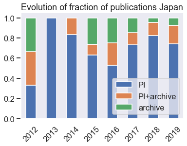


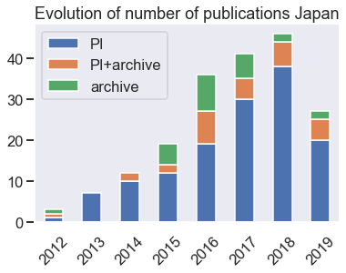


```python
df_archive_ea = pd.DataFrame({
    'Japan':df_ea[df_ea["first_country"]=='Japan']['archivedata'].value_counts(), 
    'Taiwan':df_ea[df_ea["first_country"]=='Taiwan']['archivedata'].value_counts(),
    'Korea':df_ea[df_ea["first_country"]=='Korea']['archivedata'].value_counts()})

```


```python
df_archive_transposed_ea = (df_archive_ea/df_archive_ea.sum()).T
df_archive_transposed_ea.plot.bar(stacked=True,rot=45,title='Fraction of publications making use of archival data ')
plt.show()

display(df_archive_ea)

df_archive_transposed_ea = df_archive_ea.T
df_archive_transposed_ea.plot.bar(stacked=True,rot=45,title='Number of publications making use of archival data ')
plt.show()
```


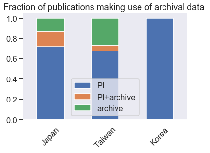


<div>
<style scoped>
    .dataframe tbody tr th:only-of-type {
        vertical-align: middle;
    }

    .dataframe tbody tr th {
        vertical-align: top;
    }

    .dataframe thead th {
        text-align: right;
    }
</style>
<table border="1" class="dataframe">
  <thead>
    <tr style="text-align: right;">
      <th></th>
      <th>Japan</th>
      <th>Taiwan</th>
      <th>Korea</th>
    </tr>
  </thead>
  <tbody>
    <tr>
      <th>PI</th>
      <td>137</td>
      <td>33</td>
      <td>8.0</td>
    </tr>
    <tr>
      <th>PI+archive</th>
      <td>29</td>
      <td>3</td>
      <td>NaN</td>
    </tr>
    <tr>
      <th>archive</th>
      <td>25</td>
      <td>13</td>
      <td>NaN</td>
    </tr>
  </tbody>
</table>
</div>


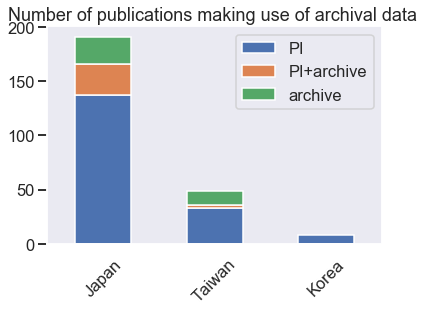


# Appendix
## A List of countries by regional classification


```python
appendix_df = pd.read_pickle('./df_region.pkl')
print('EA\n',appendix_df.index[appendix_df[0]=='EA'])
print('EU (=ESO)\n',appendix_df.index[appendix_df[0]=='EU'])
print('NA\n',appendix_df.index[appendix_df[0]=='NA'])
```

    EA
     Index(['Taiwan', 'Korea', 'Japan'], dtype='object')
    EU (=ESO)
     Index(['Belgium', 'Poland', 'Austria', 'Germany', 'UK', 'Denmark', 'Spain',
           'Netherlands', 'France', 'Portugal', 'Czech Republic', 'Sweden',
           'Switzerland', 'Ireland', 'Italy'],
          dtype='object')
    NA
     Index(['Canada', 'USA'], dtype='object')


## The number and fraction of publications per Asian country except EA


```python


regionname = ['Oceania+Asia']

df_asia = df_xml[(df_xml["region"]==regionname[0]) ]
df_asia['first_country'] = [df_asia.loc[i,'countries'][0] for i in df_asia.index]

#print(df_region.index[df_region[0]==regionname[0]])

fig, ax = plt.subplots(1, 1)

table(ax,df_asia["first_country"].value_counts(),
      loc='upper right', colWidths=[0.2, 0.2, 0.2])

df_asia["first_country"].value_counts().plot(kind="bar",
                                     title='The number of publications per asian countries',
                                     ax=ax,)

plt.show()

#for country in ['China','Vietnam','Australia']:
#    df_asia_trim = df_asia[df_asia['first_country']==country]
#    evolutionpub(df_asia_trim,country)
#    plt.show()

df_asia['first_country'].value_counts().plot.pie(autopct='%i',
    title='The fraction of publications per Asian country ({:})'.format(len(df_asia)))

plt.show()

```

    /Users/rmiura/anaconda3/lib/python3.6/site-packages/ipykernel_launcher.py:6: SettingWithCopyWarning: 
    A value is trying to be set on a copy of a slice from a DataFrame.
    Try using .loc[row_indexer,col_indexer] = value instead
    
    See the caveats in the documentation: http://pandas.pydata.org/pandas-docs/stable/indexing.html#indexing-view-versus-copy
      


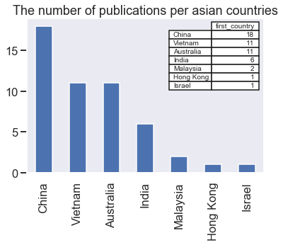


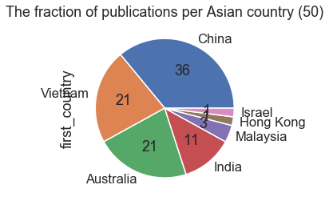


## The fraction of publications making use of PI/archive data for Asian countries except EA


```python
df_asia['archivedata'].value_counts().plot.pie(autopct='%i',
    title='The number of publications of Asian countries except EA ({:})'.format(len(df_asia)))
```


    <matplotlib.axes._subplots.AxesSubplot at 0x1a2bd39978>


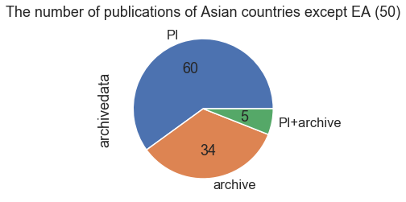


```python

```


```python

```


```python

```


```python

```
